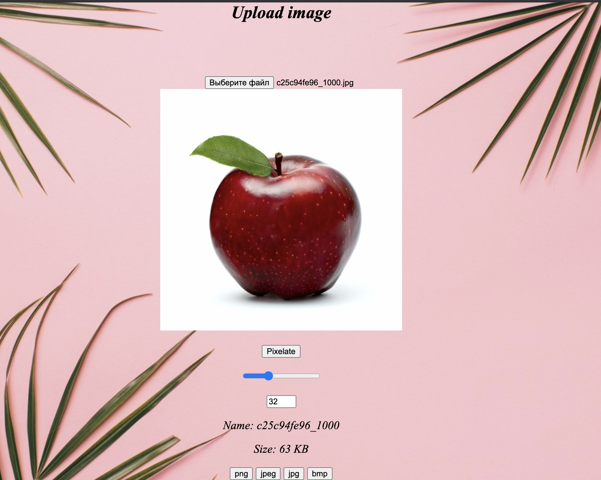
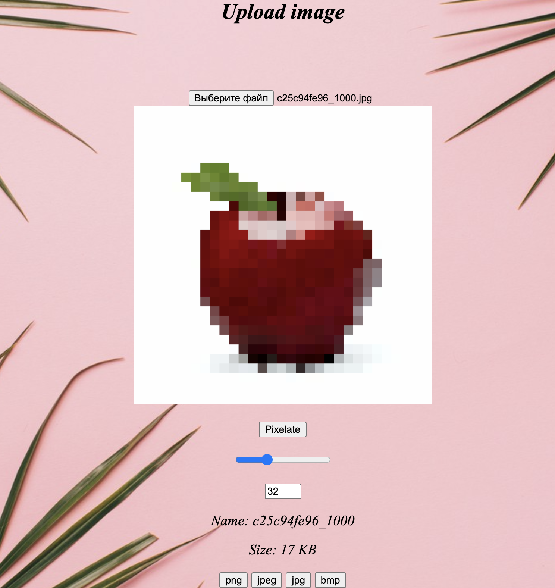
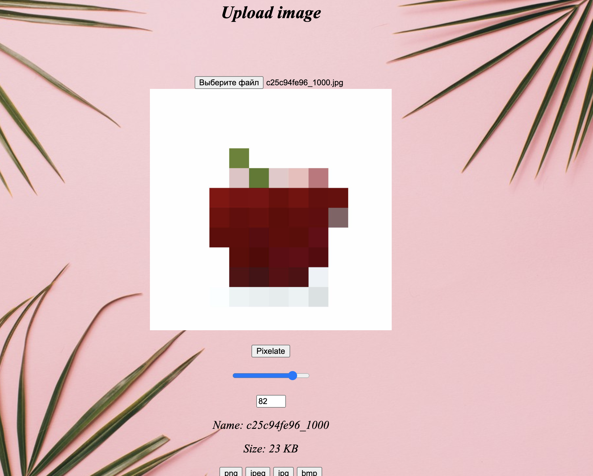

<h1 align = "center">Pixelizator<h1>
  
## Description

Created for pixelate images. 
Useful if you want to create an pixel art with own photo or image. 
The pixelization method is as follows: the image is divided into squares (blocks, pixels) of the desired size, 
in each of them the main color is determined, after which the square is completely filled with this color. 
  
## Usage
  
###### 1. Clone repository
###### 2. In IDE open directory 11
###### 3. Configuration by Tomcat(build by http://localhost:8080/Pixelizator_war_exploded/)
###### 4. Run
  

_created by Ostanya_ 
